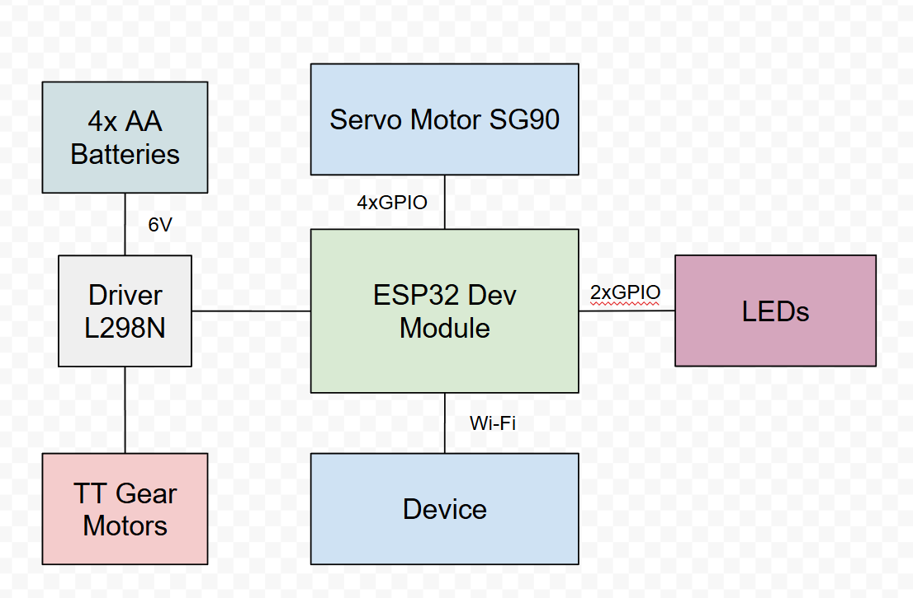

# Bluetooth Remote Controlled Forklift

## Introduction

The project represents a four-wheeled RC forklift that is being controlled via Bluetooth, which has moving forks. The carriage's movement is being signaled through a specific blinking light.

The idea started from my passion for forklifts, that i enjoyed watching growing up, and RC cars, which were a total mystery to me. Also, tinkering is something that i have been doing for my whole life. With that being said, this project harmoniously combines many of my passions and interests.

## General Description

The RC forklift has a sliding carriage with attached forks. Two LEDs are playing the set blinking light animation while the carriage is moving. The sliding is done via a servo motor which has a similar mechanism to that of a pulley. Two motors connected to the front wheels ensure the movement, as well as the steering of the forklift. This whole project revolves around the ESP32 as the main microcontroller.

### Block Diagram

TODO

## Hardware Design

### Components

| # | Name | Quantity |
|:---:|---|:---:|
| 1 | [ESP32 Dev Module](https://www.emag.ro/placa-esp32-cu-esp-wroom-32-30-pini-usb-tip-c-3874784221589/pd/D0JH59YBM/) | 1 |
| 2 | [Dual H-Bridge Motor Driver L298N](https://www.optimusdigital.ro/ro/drivere-de-motoare-cu-perii/145-driver-de-motoare-dual-l298n.html?search_query=Modul+cu+Driver+de+Motoare+Dual+L298N+Rosu&results=1) | 1 |
| 3 | [TT Gear Motor with Wheels](https://www.emag.ro/motor-cu-roata-pentru-aplicatii-arduino-3874783591812/pd/DYLB3MYBM/) | 2 |
| 4 | Breadboard | 1 |
| 5 | [4xAA Battery Holder](https://www.optimusdigital.ro/ro/suporturi-de-baterii/12375-suport-baterii-4-x-aa.html?search_query=suport+de+baterii&results=58) | 1 |
| 6 | SG90 Servo Motor | 1 |
| 7 | Red LED | 1 |
| 8 | Green LED | 1 |
| 9 | 220 Ohm Resistor | 2 |
| 10 | AA Battery | 4 |

### Circuit diagram

TODO

## Software Design

For this project I will be using Arduino IDE.

## Results

## Conclusions

## Resources
